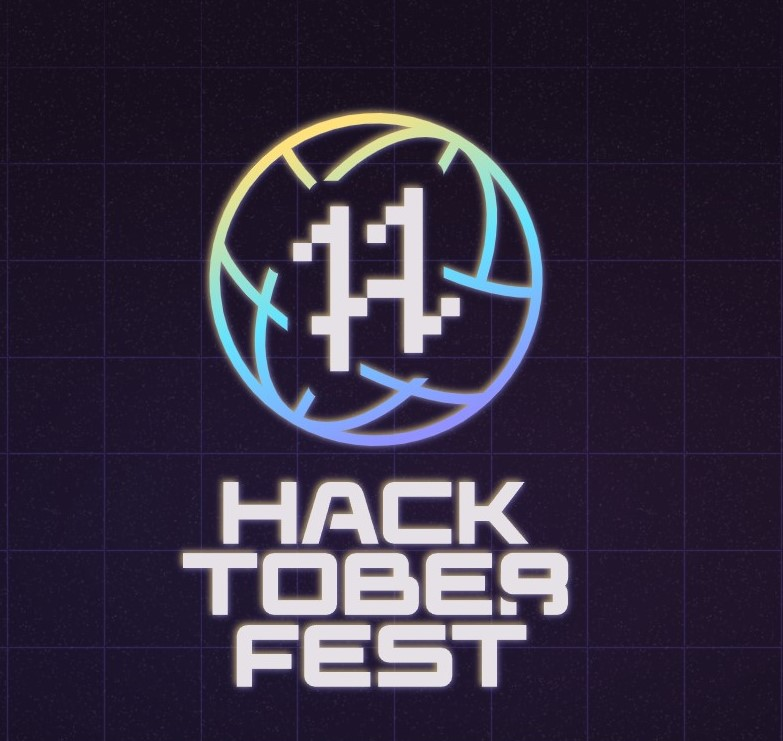

<h1 align="center"> Hacktoberfest 2022 🎉</h1>

    

  

 
 

### 🗣 Hacktoberfest encourages participation in the open source community, which grows bigger every year. Complete the 2021 challenge and earn a limited edition T-shirt.

📢 **Register [here](https://hacktoberfest.com/) for Hacktoberfest and make four pull requests (PRs) between October 1st-31st to grab free SWAGS 🔥.**

> Upload your code in this repository to particular section if folder is not present then create folder.
> some more repos for contribution

<h1 align="center">  HacktoberFest 2022  </h1>

<h4> You can make folders of programming languages and also you can contribute in the repo's below.</h4>

<h4> Feel free to contribute to this repo by creating and editing little programs in any programming language and make different folders for the code you want to contribute. </h4>

If you want to practice to make a pull request, follow the [CONTRIBUTING.md](/CONTRIBUTING.md)
  
Check out `good-first-issues` for contributing [here](https://github.com/GDSC-IETDAVV/hacktoberfest_2022/issues?q=is%3Aopen+is%3Aissue+label%3A%22good+first+issue%22)

 

#
### Contributing
<h4> See also the list of <a href="https://github.com/GDSC-IETDAVV/hacktoberfest_2022/graphs/contributors">contributors</a> who participated in this project. </h4>
Please read <a href="https://github.com/GDSC-IETDAVV/hacktoberfest_2022/blob/main/CONTRIBUTING.md"> CONTRIBUTION.md </a> and <a href="https://github.com/GDSC-IETDAVV/hacktoberfest_2022/blob/main/CODE_OF_CONDUCT.md"> CODE_OF_CONDUCT.md </a> for details on our code of conduct, and the process for submitting pull requests to us.

### Rules

* Read the [CONTRIBUTING.md](/CONTRIBUTING.md) file.
* Respect people.
* Be friendly, helpful, and patient.
* You can contribute in any way.

### Support

If you like this project, please consider supporting it by giving it a ⭐️. It will help us to grow and improve this project and help others to find it.

### Conclusion

- Happy Contributing! 🎉 
- May you have a great Hacktoberfest 2022! 🎉
- If you have any questions, feel free to ask me. I will be happy to help you. 😊

### References

- [Hacktoberfest 2022](https://hacktoberfest.com/)
- [Hacktoberfest 2022 Participation Guidelines](https://hacktoberfest.com/participation/)

 

- This project is a part of Hacktoberfest 2022 and  open to all members of the GitHub community. Any member may contribute to these projects without being a collaborator or a maintainer and earn a T-shirt from DigitalOcean and DEV by making four valid pull requests (PRs) between October 1-31 (in any time zone).

- The first 40,000 participants (maintainers and contributors) who complete Hacktoberfest can elect to receive one of two prizes: a tree planted in their name, or the Hacktoberfest 2022 t-shirt.

## Rules

- Don't use filthy words and be welcome for beginners and other people in this community.

---

## Github Contribution Rules
- Pull requests can be submitted to any opted-in repository on GitHub or GitLab.
- The pull request must contain commits you made yourself.
- If a maintainer reports your pull request as spam, it will not be counted toward your participation in Hacktoberfest.
- If a maintainer reports behavior that’s not in line with the project’s code of conduct, you will be ineligible to participate.
- To get a shirt, you must make four approved pull requests (PRs) on opted-in projects between October 1-31 in any time zone.
- This year, the first 40,000 participants can earn a T-shirt.
---

Steps for adding your name below

    1. Fork this repo
    2. Edit `CONTRIBUTERS.md` file
    3. Add your Name also link your github profile
    4. Make pull request

### Contributors

<!-- ALL-CONTRIBUTORS-LIST:START - Do not remove or modify this section -->
<!-- prettier-ignore-start -->
<!-- markdownlint-disable -->

<!-- markdownlint-enable -->
<!-- prettier-ignore-end -->
<!-- ALL-CONTRIBUTORS-LIST:END -->

Contributions of any kind welcome!

